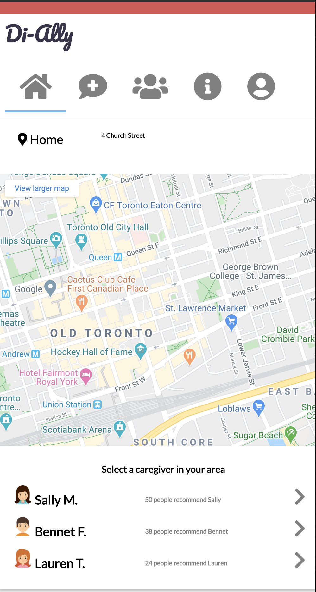
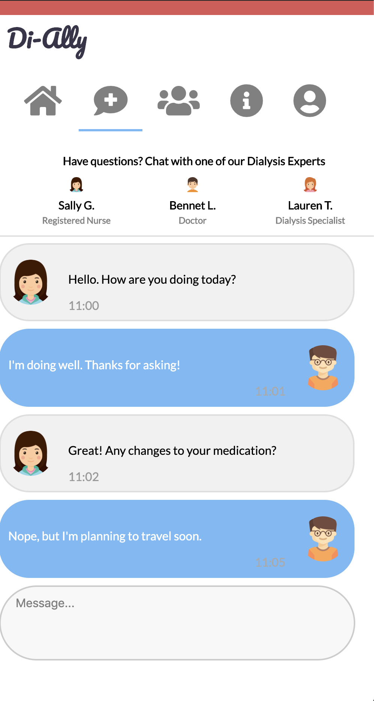

# Hack the Globe 2020
### Shammie Debnath, Meggie Debnath, Smiriti Shankar, Rajeev Sowamber

Di-Ally is a mobile application that aims to help improve access and increase support for home dialysis. This is done by connecting dialysis patients to nearby professionally trained volunteers and medical experts.

## Landing page

When patients first log in, they can enter their location and view nearby volunteers on the map. Volunteers have information about their training, qualifications, and the number of recommendations they have recieved.

## Contact experts

Another feature of this app is the ability to communicate with experts and recieve quick feedback on questions and concerns about their treatment.

